

# How to configure the DHIS2-based WHO Data Quality Tool

# How to download and install the app

 [Note to the facilitator:  this section can best be presented using live online projection of the play instance of DHIS2 ([https://play.dhis2.org/2.33.4).](https://play.dhis2.org/2.33.4).To begin practice with configuration, the table that appears on the “Numerators” page after clicking on More-Administration should have blank values for all numerators for “Data element/indicator” and “Dataset”. After Exercises 1 to 3 have been completed, this table should appear as shown in Annex 1.  This guide deals with configuration of only the numerators for the Tool (the first 5 of the 8 tabs of the Administration function).  Configuration of the Tool denominators and the Tool external comparisons is discussed in an annex of the companion guide entitled “How to Use the WHO Data Quality Tool.docx” ]

1. Use the App Management application to download and install the latest version of the DQ Tool

    a.From the Home page of DHIS2, someone with Super-User authority should type “app” on the search apps line then click on App Management

     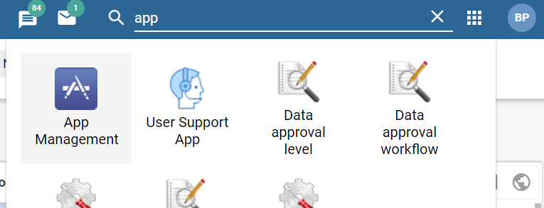

    b. Click on App Store then, under WHO Data Quality Tool,  click on INSTALL V 1.2.3[^1]

     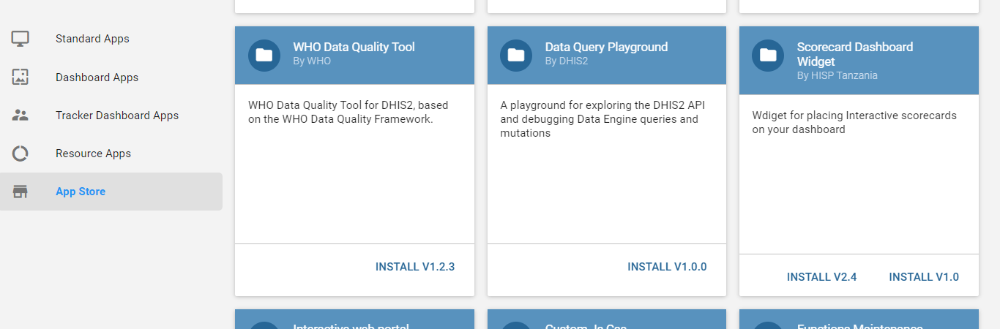

    c. From the Home page of DHIS2, type “WHO” on the search apps line and the shortcut for The WHO Data Quality Tool should then appear. Click on the shortcut to launch the app.

     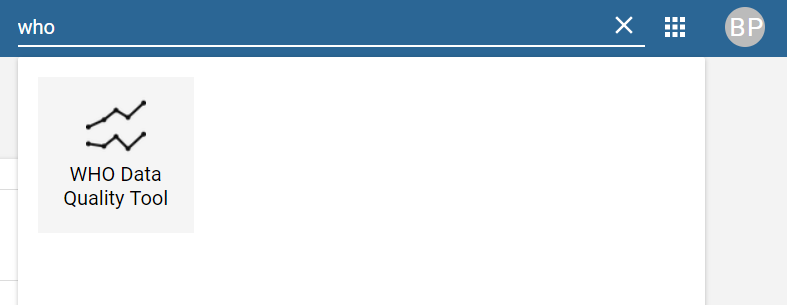

    > Note: 
    At first, the app may not be visible/accessible except to persons who have higher level administrative privileges. Once the DQ Tool has been configured and is ready to be viewed and used more widely, the data manager can change the access requirements so that people with ordinary authorities can access/view the app.  To do this, from the Home page a Super-User should find and click on the “Users” app.  Click on “User Role” to launch “User role management”.  In the list of “Role”, find and click on the role to which you want to assign the authority (e.g. “User”).  From the drop-down menu click on “Edit”.  Scroll down to find the “Authorities” section.  Scroll down in this section to find and place a check In the box for “WHO Data Quality Tool app”. Click on “Save”.  The icon for the WHO Data Quality Tool should now be visible to the user when clicking on the search apps icon on the home page.

# How to configure the numerators for the Tool 

Anyone with authority to add indicators should be able to configure the app.  

## Demonstration of how to map each “reference numerator” to a DHIS2 data element or indicator

2. From the Home page of DHIS2, type “WHO” on the search apps line and the shortcut for The WHO Data Quality Tool should then appear. Click on the shortcut to launch the app.

 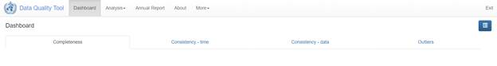

**Notice** the message that appears the first time that you launch the Tool.  Click OK and this message will disappear.

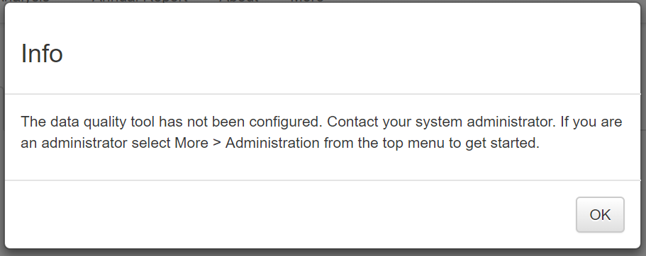

3. Before we begin to configure the tool, let us familiarize ourselves with some of the different pages of the Tool.  Each time that you launch the Tool, you will see the main menu at the top.  This is used to select between several different functionalities. Notice that the word “Dashboard” is highlighted. The Dashboard function is selected by default.

 
4. The Dashboard has 4 different pages.  You use the tabs near the top to select a page.  The Completeness page is shown by default.  Notice that this page is blank.  The Tool does not display any results until it is configured.

 

5. The Dashboard also has its own menu.  You open and close this menu by clicking on the blue menu icon on the left of the page, near the top.

 

Later, we will learn how to use this menu to select a Group of data sets, a period and group of organization units (i.e. a geographic region) for review

 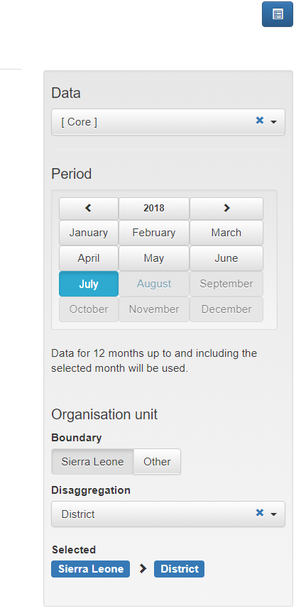

6. To configure the Tool, click on More from the main menu of the Tool then select Administration

 

7. At first you will see a message saying that you do not have access to change the configuration.  You will see this message, at least briefly, even if you have Super-User access.  

 

8. Be patient and wait a minute or two for the message to disappear and for a table to appear:

 
 

9. Notice the tabs that appear in a horizontal row across the top of the table:  Numerators; Numerator groups; Numerator relations; Numerator quality parameters; Denominators; Denominator; External data comparison. Part 1 of this guide discusses how to configure the first 4 of these tabs.

10. The 1st column of this table provides the name of a “Group”.  As the term is used here, a “Group” is a set of numerators.  Groups are typically for a specific program like HIV/AIDs, Immunization or Maternal health.

11. The 2nd column of this table lists “Reference numerators”.  These are standard indicators which are recommended by WHO.  Later we will learn how to customize this list by adding new numerators or ignoring some Reference numerators.  Notice that this column lists numerators (e.g. DPT 1 doses) rather than indicators (e.g. DPT 1 coverage).  The reason for this is that the Tool assesses numerators separately from denominators.

12. The 3rd column is headed “Core”.  There is a check mark in the cell for each Reference numerator which WHO recommends be included as part of a small (less than 10) multi-program set of indicators to feature on the dashboard of the DQ Tool and in an annual report on the core datasets.  Later, we will learn how to modify the list of Core numerators.

13. The 4th column is headed “Data element/indicator”.  This is the column in which we will specify the DHIS2 data element or indicator which corresponds to the Reference numerator.  Notice that this column is now blank.  To configure the Tool you must identify which country-specific DHIS2 data element or indicator corresponds to each Reference numerator.  This process of matching is called “mapping the Reference numerator to a Data element/indicator”.  

14. The 5th column is headed “Dataset”.  This too is now blank.  As part of the next step, when you map a Reference indicator to a DHIS2 data element or indicator you will also specify which DHIS2 data set the data for this data element or indicator comes from.

15. To understand the process of mapping, click on the Edit button for the Reference numerator “DPT 1”.  By default, the first 3 fields for this WHO standard Reference numerator have already been filled in. The box for Core is not checked.  However, if you decide to include this indicator in your small core set, you should check this box.

 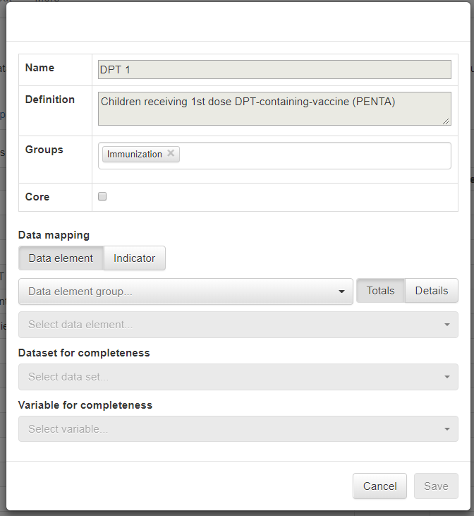

16. Under Data mapping, you leave “Data element” selected if you want to map the Reference numerator to a DHIS2 data element.  Alternatively, you may want to map the Reference numerator to an Indicator configured to add together the value of multiple data elements.  As an example, suppose that there was one data element for “DPT 1, &lt; 12 months” and a separate data element for “DPT 1, ≥ 12 months”.  Instead of choosing one data element or the other you could configure an indicator such as “Total DPT 1” = “DPT 1, &lt; 12 months” + “DPT 1, ≥ 12 months”. If this indicator did not already exist, you would have to exit the Tool then use the Maintenance-Indicator app to configure it.  The denominator of this new indicator would be the number 1.  Hence, we call this type of indicator a “numerator only indicator”.

17. Notice the box beneath “Data element/Indicator”.  It asks for the ‘Data element group” (or, if Indicator is selected, the “Indicator group”.  There is no option to select from a list of “All data elements” or “All indicators”.  Instead, a data element group or indicator group must first be selected.  This means that if the data element you want is not part of a data element group then you must exit the Tool and use the Maintenance-Data element group app to assign the data element to a group.  Likewise any indicator you want to select must first be assigned to an indicator group by using the Maintenance-Indicator group app.

18. For our example, let’s leave Data mapping set to “Data element” then click on the down arrow to the right of “Select data element group” to view the drop-down menu.  Find and select “Immunization”. Note:  the name of the relevant data element group or indicator group may be different on your own DHIS2.

19. Click on the down arrow to the right of “Select data element” to see the drop-down menu.  Find and select “Penta 1 doses given”.  Note:  the name of the relevant data element or indicator may be 
different on your own DHIS2.

20. Next, we must fill in the “Select data set” field under “Data set for completeness”.  Click on the down arrow to the right of “Select data set” to view the drop-down menu.  The Tool has pre-selected the possible data sets.  Confirm that the correct data set is listed (“Child health”) and select it. This is the data set that the Tool will use to assess for the completeness of reporting. Note:  the name of the relevant data set will likely be different on your own DHIS2.  

21. Next, we must fill in the field for “Select variable” under Variable for completeness.  When you click on the down arrow to the right of “Select variable”, notice that the list consists of fully disaggregated detailed data elements with their corresponding categories.  You cannot select the aggregated total data element that you just picked (under Data mapping).  Instead you are forced to select a detailed data element. It is usually best to select as a variable the detailed data element for which data is most likely to be reported.  In our example, this is “Penta 1 does given Fixed, &lt; 1y”.  This is the detailed data element which the Tool will use to assess “Completeness of indicator data” – assessment of the reporting for a specific data element as opposed to assessment of the reporting for an entire data set[^2].

22. Only when you have filled in ALL of the Fields (the box for “Core” is optional) will the Tool permit you to click on Save.

 

23. Once you have successfully Saved the mapping for a Reference numerator, the Tool will again show the full table of numerators. Notice how the cells for “Data element/indicator” and “Dataset” are now filled in for the numerator you have just mapped. Also notice that the Clear button is brighter.  If you wanted to, you could clear the mapping.  Clearing a WHO standard Reference numerator will simply clear the mapping information – it will not remove the Reference numerator from the table.  On the other hand, if the row was one that you had added (using the blue Add button at the bottom of the page), if you clicked on “Clear” the row would disappear from the table.

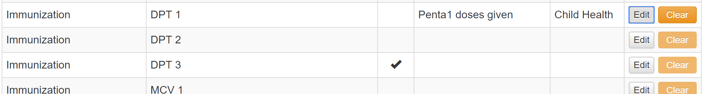

24. For more practice, let’s repeat the process for DPT3. Click on Edit.  Notice that the box is checked for “Core”.  WHO recommends DPT 3 as the Core indicator for immunization programmes.  You could change this, but let’s leave it as it is.  Next, fill in all of the other fields and Save your mapping. 

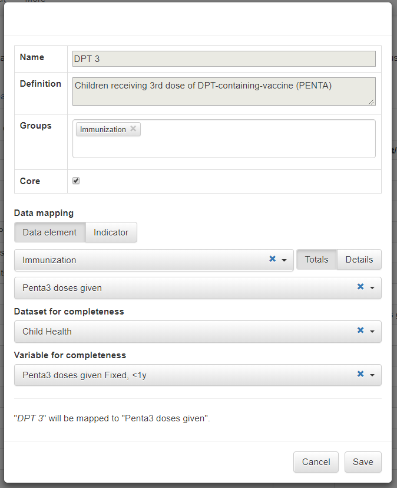

25. Notice that, so far, DPT 1 and DPT 3 are the only numerators with “Data element/indicator” and “Dataset” specified.

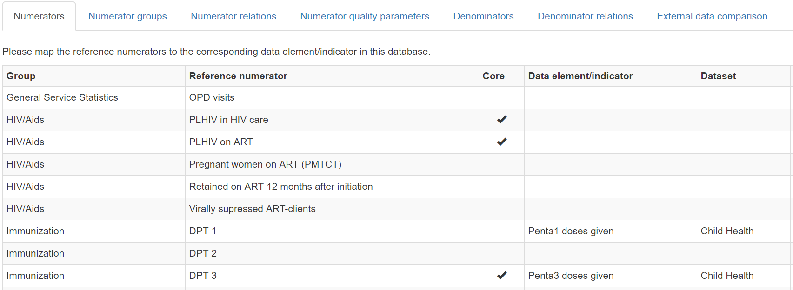

If we go back to the dashboard of the Tool we will see that, as soon as you have mapped at least one reference numerator for a Group, the name of that Group will appear in the drop-down list for “Data”.  In this way, the Tool can be set to assess all Core numerators or to assess all of the numerators that have been mapped for a single Group.

26. Next, let’s go back to the More-Administration function and the Numerators page.  To add a new numerator, we can click on the blue Add button at the bottom right of the Numerators page

 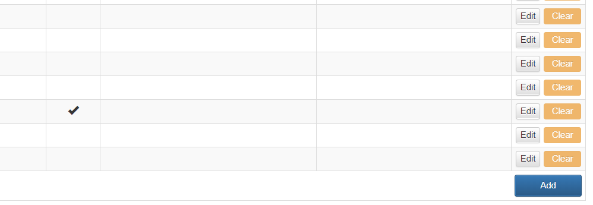

Let’s add “Number of physicians”.  We must assign the new numerator to a Group – there is no default Group.  For now, choose the “General Service Statistics” group.  Complete the remainder of the fields.  The existing data element “Doctor” is in the “Staffing” data element group.  Once you have filled in all fields, you can Save the new numerator with its mapping. 

 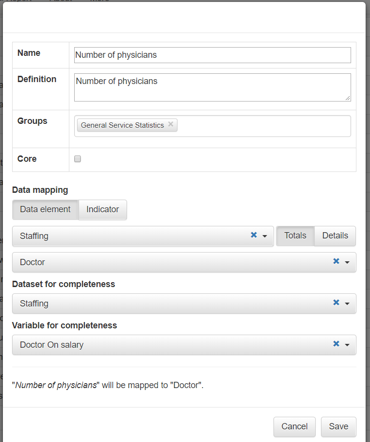

27. If we don’t want to assign the new numerator to an existing Group then we must use the “Numerator groups” tab to add a new Group.  Click on this tab now.

 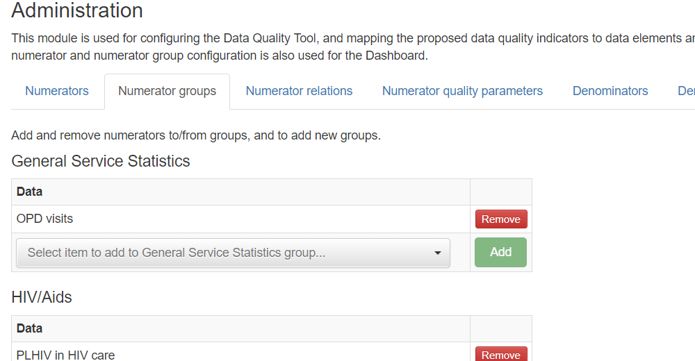

28. Then click on the Add group button at the bottom left of the “Numerator groups” page, type in the name for the new Group and Save it.

 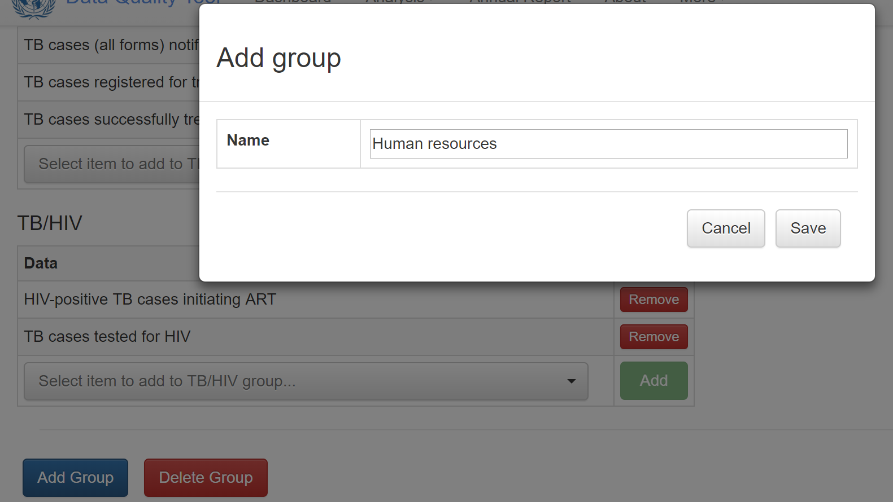

29. The name of this new Group will then appear in various tables and menus.  For example, it now appears on the “Numerator groups” page.  Notice that no numerator has yet been assigned to this Group.  

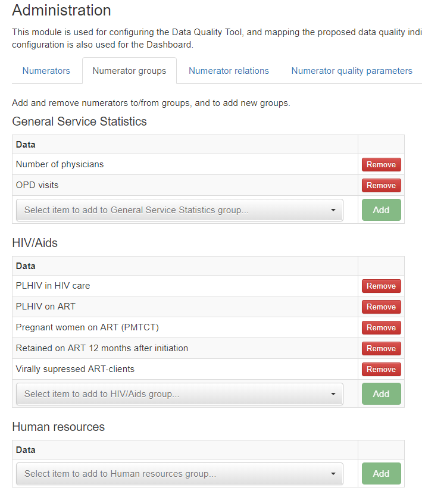

30. We can assign to this Group a numerator that we have already mapped by clicking on the down arrow to the right of “Select item to add …” and selecting the numerator from the drop-down menu,

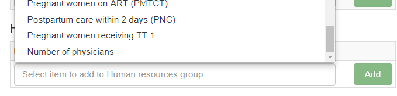

Notice that the “Add” button is now brighter. Click on the “Add” button.

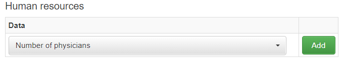

The numerator you just selected will appear under the new Group.

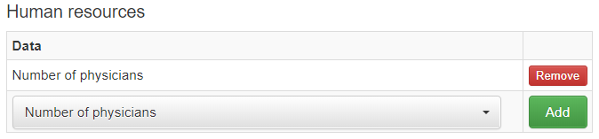

31. The name of the new Group will now appear next to our new numerator on the Numerators page

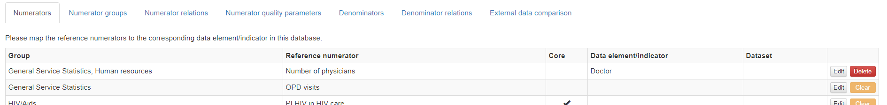

32. If we want, we can edit this new numerator so that it is only in the Human Resources Group. Notice, however, that you must Save all edits and the Save button is greyed out (inactive).  The Tool will not permit you to Save unless all fields have been completed.

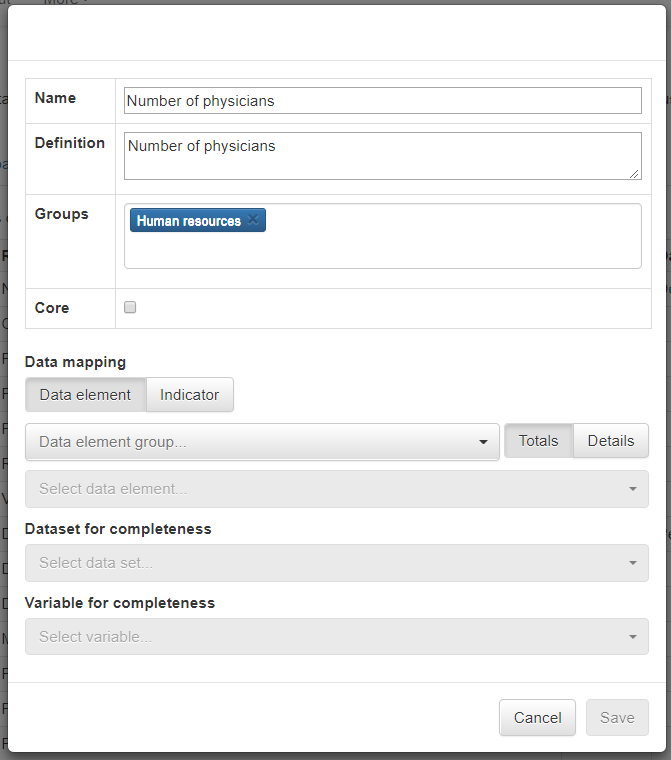

33. Unfortunately, the Tools editor does not remember anything about the previous settings so you must re-enter everything.  Then you can Save.

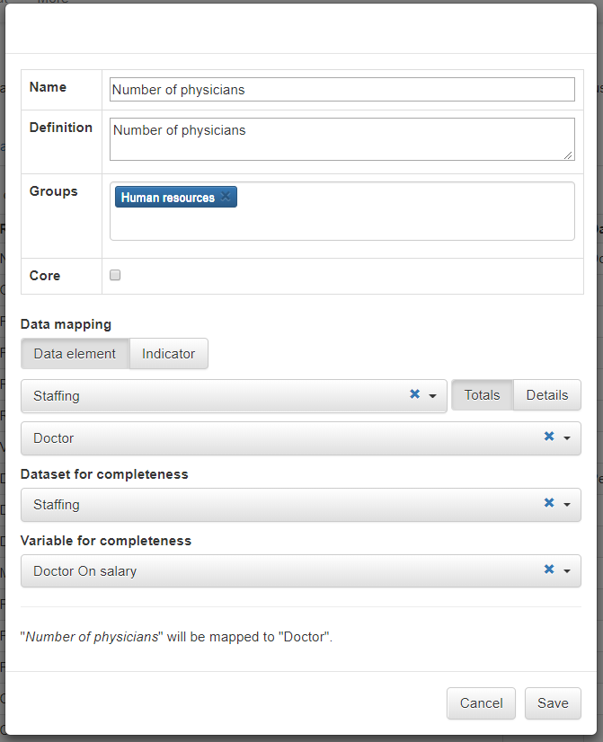    

And the new numerator is now correctly mapped.

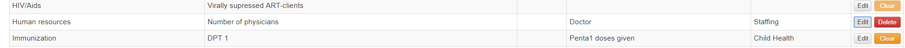

Now that you understand the mechanics of how to “map” reference numerators to DHIS2 data elements/indicators, you have reached the critical step of deciding which data elements/indicators to map to.  This is discussed in the next section

## Select the data elements/ indicators to map to

34. For several reasons, it is not always easy to choose the best data element or indicator for a given reference numerator: [Note to the facilitator:  the following points are presented in the ppt named “Configuring the tool with the right data elements”.]

a. **It may be hard to find the data element/indicator that you want**
         
i. There may be a very long list of data elements, making it difficult to find the data element you want.

*Figure 1: Screenshot from the Maintenance-Data element app showing that this particular instance of DHIS2 has 8,171 data elements.*

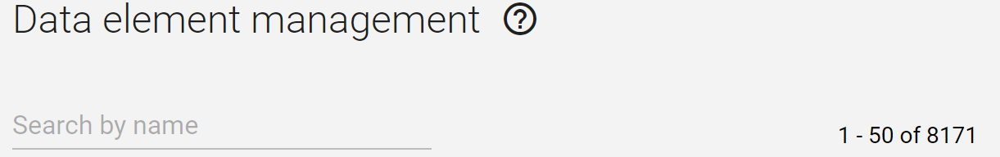
With the Pivot Table app, the lists of [All data elements] can be filtered by typing something on the search line.   

_Figure 2:  Screenshot showing how a Filter can be used to identify data elements with "DPT" in the name.  Note:  other names such as "DTP" and "Penta" should also be tried.  Also, try the same filters with [All indicators]_

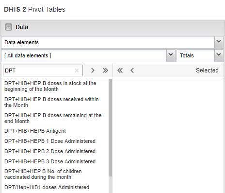

**However, the best solution is to have a well-designed data element group which includes only the essential data elements.  Remember that you will not be able to map a reference numerator to a data element unless the data element has already been assigned to data element group. If there are many data element groups, you may want to add a 2 digit prefix in front of the names of the most important ones so that they appear near the top of the drop down lists. DHIS2 sorts to the top of drop-down lists any data elements which begin with numbers.  The same is true for drop-down lists of indicators.**

_Figure 3:  With the Maintenance-Data element app you can configure Data element groups for the most essential data elements. If the name of the group begins with a digit, it will appear near the top of the list._

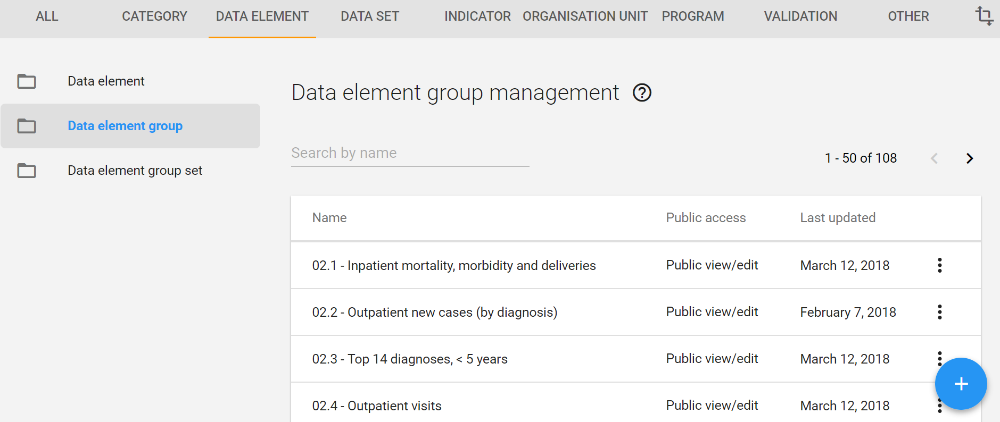

_Figure 4:  Assign to the group only those data elements which you will frequently use for analysis or select for the Data Quality Tool_

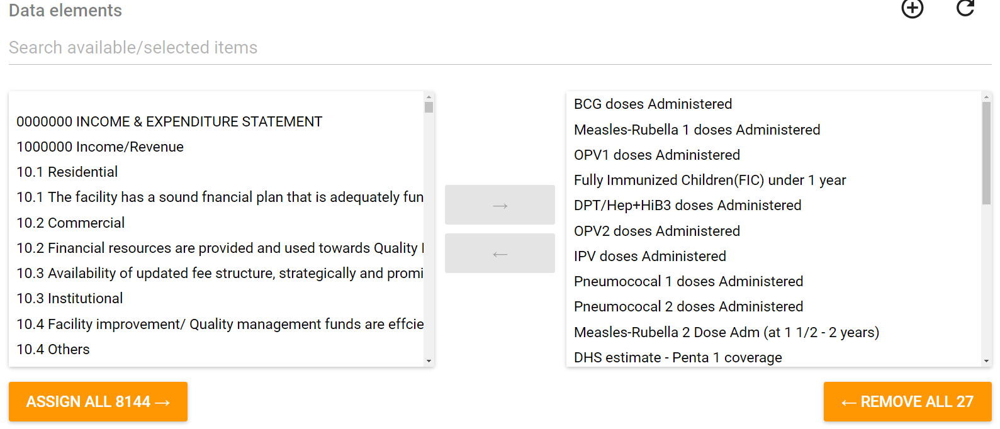

ii. There may be no single data element to which a numerator can be mapped.  For example, some DPT 1 doses may be counted with the data element “DPT 1, fixed, &lt;12 months”, some with the data element “DPT1, fixed, ≥ 12 months”, some as “DPT 1, outreach, &lt;12 months” and some as “DPT1, fixed, ≥ 12 months”.  One solution would be to map to only one of these 4 data elements (e.g. “DPT 1, fixed, &lt;12 months”).  However, if you took this approach, then the Tool would not identify data quality problems with the other 3 data elements.  A better solution would be to configure a new “numerator only indicator” equal to the sum of the 4 data elements.  If the Tool identified a suspicious value for this indicator then it would be easy to use DHIS2 to identify the specific data element which was responsible for the suspicious value for the indicator. In many cases, such an indicator has already been defined.  In some cases, however, it may be necessary to create a new indicator using the Maintenance-Indicator app.

_Figure 5:  An example of how to define the numerator of a "Numerator only indicator".  The denominator for this indicator is 1._

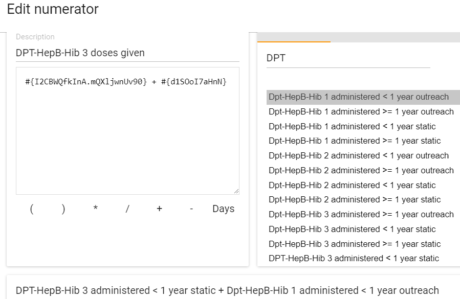

iii. Be alert to the possibility that some of the data elements or indicators which you wish to select may not be properly defined.  For some of the more complex data elements and indicators (e.g. currently on ART, total TB notifications) it may be best to use the Maintenance-Indicator app to review the definition of the indicator[^3] and, if necessary, to change it. Any changes that are made using this app will change the data viewed by everyone who accesses the production instance. Therefore, indicator definitions should never be changed without first consulting and getting explicit permission from the national data manager.  

_Figure 6:  Currently on ART is a cumulative data element.  For this reason, the data element should be configured with the unusual aggregation type "Last value (sum in org unit hierarchy)"_

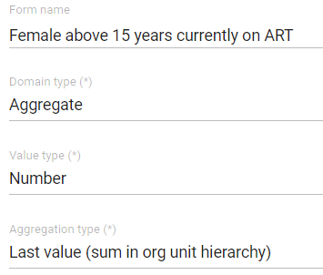

_Figure 7:  Some indicators have complex definitions.  "Total TB notifications" is calculated by adding together the values for many different types of TB.  The definition should be double checked to confirm that all required data elements have been included._

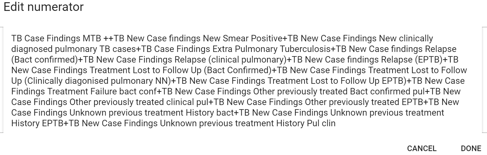

iv There may be no DHIS2 data set with data for certain important numerators.  This problem is especially common for numerators related to HIV, TB, inpatient care, human resources and supply of commodities. One solution is to obtain an Excel version of the relevant data set then use the Excel-based version of the WHO DQR Tool[^4].  An even better solution is to arrange for data from another electronic data system to be routinely imported into DHIS2.

b. **It may be difficult to select between data elements/indicators with similar names**

i. As noted, with the Pivot Table app, the list of data elements can be filtered by typing something on the search line.  This may reveal that there are multiple data elements with very similar names. This makes it difficult to select the data element with the most complete and most reliable data. 

_Figure 8:  The reference numerator "DPT 1" should be mapped to which data element?:_
1. _DPT+HiB+HEP1 Dose Administered; or_
2. _DPT/Hep+HiB1 doses Administered"?_

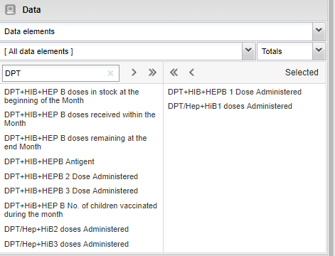

Again, the best solution is to make sure that the relevant data element group does not include data elements with highly incomplete or unreliable data.  

A good way to screen data elements is to use the Data Visualizer to configure a chart showing the trend over the last 5 years to assess which data element appears to have the most complete data and whether completeness appears to have varied. 

_Figure 9:  A chart showing the multi-year trend of the two data elements shows that only one of them has reliable values.  The program target for each year has been added to assess whether the data are reasonably complete_

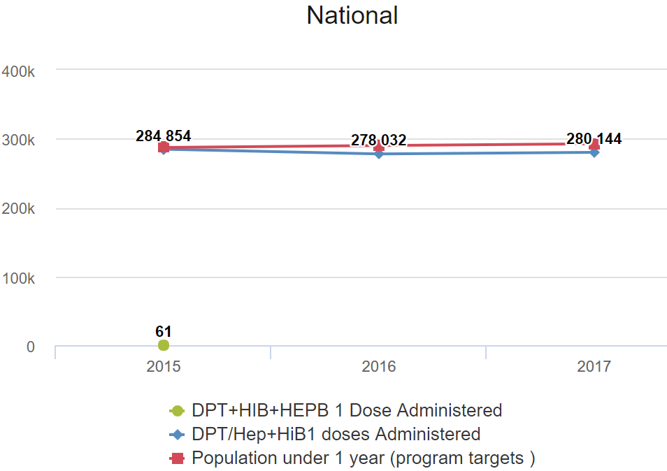

ii. If DHIS2 shows reliable Reporting rates for the respective data set, you can also use the Data Visualizer to review the trend in completeness.  Such a chart will also tell you for which years there are data for the data element.  You may find that the Reporting rate of one or more important data sets is low (less than 75%) or has varied from year-to-year.  

_Figure 10: A chart showing a low and variable Reporting rate for the Maternal health dataset._

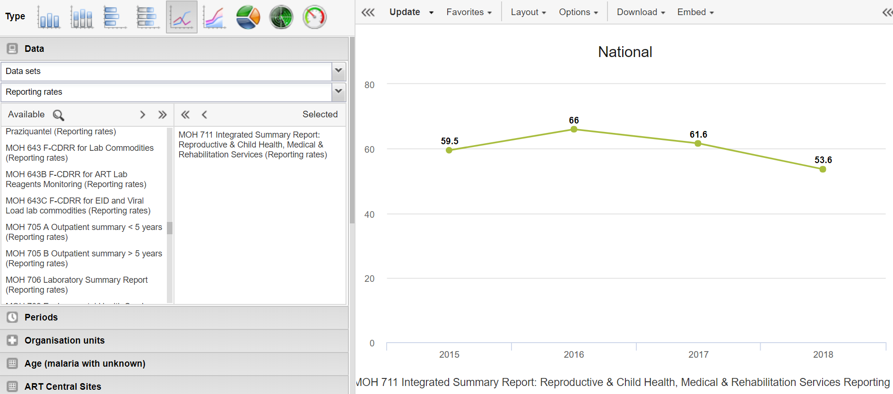

_Figure 11:  A chart showing that the reporting rates for multiple data sets were substantially lower prior to last year.  Note:  When reporting rates were so much lower during previous years, the year-to-year consistency is likely to be poor._

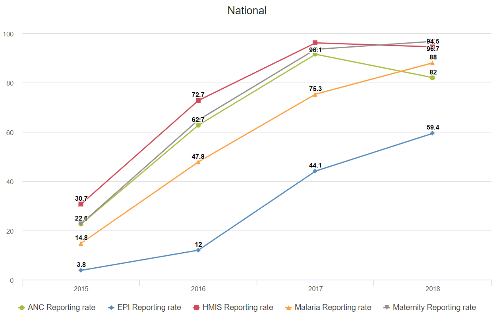

If, for a particular numerator, there is no relevant data set with a Reporting rate that is high and consistent from year to year, then you may have no choice but to map to a data set with incomplete data.  You should keep in mind, however, that the Tool is likely to find many problems with the quality of incomplete data due simply to variations in the completeness over time and between geographic sub-units.  If the reporting rate for last year is below 50%, the data set/data element should not be designated as Core.  Explore whether there is a non-DHIS2 data set with more complete data for the data element.  If so, you may be able to use the Excel-based DQR Tool to review the quality of the data.  

If the reporting rate was substantially lower during previous years, then the Annual Report is more likely to show poor year-to-year consistency even if there was no other problem with data quality.  For assessment of year-to-year consistency, it is best to exclude data from years for which there is no data set with a DHIS2 reporting rate nationwide of at least 50%.

iii. DHIS2 may not reliably reflect the Reporting rates for data that are imported.  The best solution is to also import the meta-data required for DHIS2 to track the Reporting rate.  Special guidance has been drafted for this purpose (see “How to update the reporting completeness of imported DHIS2 data”).

_Figure 12: Screenshot showing how DHIS2 and the DHIS2-based WHO Data Quality Tool may sometimes not show reliable findings on the reporting rate of imported data._

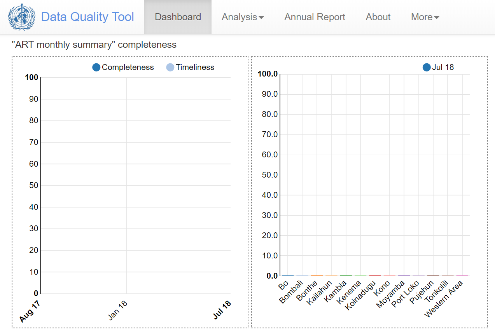

iv. For certain of the data elements that you want to select (or which are used to calculate “numerator only indicators” that you want to select), it may not be clear which data set they belong to.  When there is such uncertainty, use the Maintenance-Data set to find the data set to which you believe it may belong.  Click on “edit” to confirm that the data element has been assigned to the data set. 

_Figure 13: Screenshot of showing some of the data elements assigned to the “Maternal health” dataset, as viewed using the Maintenance – Data set app._

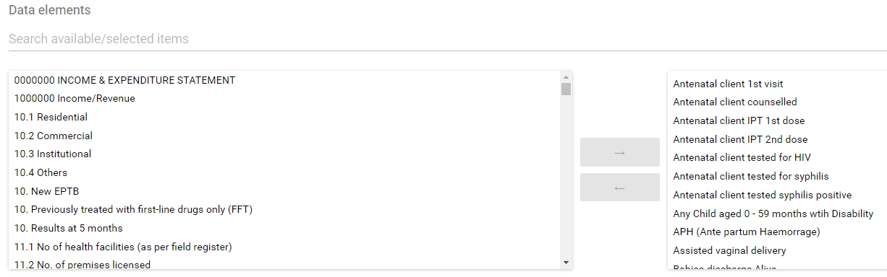

35.**Exercise 1**: Complete the following table.  Configure any new indicators or data element groups or indicator groups which are necessary.

<table>
  <tr>
   <td><strong>Numerator</strong>
   </td>
   <td>
<ol>

<li>
<strong> Possible data element (DE) / indicator (Ind) to map to</strong>
</li>
</ol>
   </td>
   <td>
<ol>

<li>
<strong>Group for each possible data element or indicator</strong>
</li>
</ol>
   </td>
  </tr>
  <tr>
   <td><em>Example: IPTp 1</em>
   </td>
   <td><em>IPT 1st dose given at PHU</em>
   </td>
   <td><em>ANC</em>
   </td>
  </tr>
  <tr>
   <td>DPT 1 (Penta 1)
   </td>
   <td>
   </td>
   <td>
   </td>
  </tr>
  <tr>
   <td>DPT 3 (Penta 3)
   </td>
   <td>
   </td>
   <td>
   </td>
  </tr>
  <tr>
   <td>ANC 1
   </td>
   <td>
   </td>
   <td>
   </td>
  </tr>
  <tr>
   <td>Total malaria rapid diagnostic tests (positive + negative)
   </td>
   <td>Hint:  Two existing data elements are required.  They are not yet in any data element group. So a new indicator needs to be configured and this indicator needs to be assigned to an indicator group.
   </td>
   <td>
   </td>
  </tr>
</table>

## Configure the Numerators page of the WHO Data Quality Tool

**Exercise 2:**

36.Return to the Numerators page of the Tool (launch the Tool then click on More then click on Administration).

37.For each of the first 4 numerators in your table from Exercise 1, click on Edit, complete the configuration and Save.

38.For the 5th numerator (Total RDT tests), use the blue Add button to add it. Complete the configuration.

## Demonstration of how to configure the Numerator relations page of the Tool

[Note to the facilitator:  this section can best be presented using live, online projection of the play instance of DHIS2 ([https://play.dhis2.org/demo/dhis-web-commons/security/login.action](https://play.dhis2.org/demo/dhis-web-commons/security/login.action) )]

39.While still in More-Administration, click on the tab labeled “Numerator relations”.  This is where you will specify pairs of data elements which should be compared to each other.  By default, the Tool may recommend some pairs.

In addition, there is a blue Add button in the lower right corner of the page that can be used to add new “Numerator relations”. 

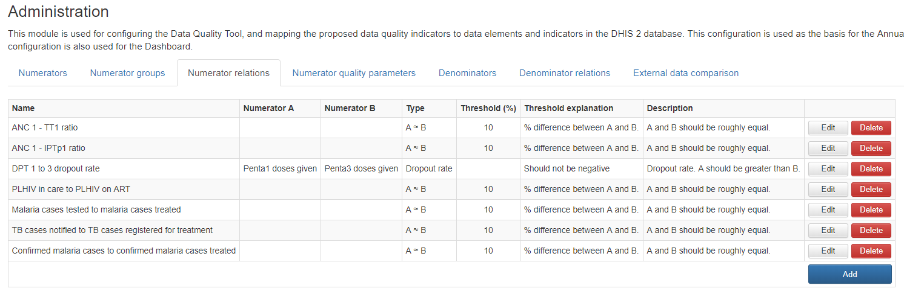

40.We have already mapped DPT1 and DPT3, so the Tool is able to automatically configure the relation of DPT 1 to DPT3.  Numerator A (DPT 1) has been mapped to “Penta 1 doses given”.  Numerator B (DPT 3) has been mapped to “Penta 3 doses given”.  By default, this relation is set to Type = Dropout rate.

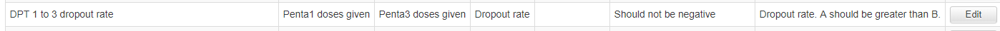

41.To see how “Numerator relations” are configured, click on the Edit button to the right of “ANC 1 – IPTp 1 ratio”.  A default relationship “Type” is suggested: A = B.  And a default Threshold is suggested: 10%.  The meaning of “Threshold” depends upon the relationship type.  For relationship type of A = B, the threshold is defined as the maximum % that Numerator A can differ from Numerator B.  For example, if ANC 1 and IPTp 1 differed by more than 10%, then this might suggest a possible data quality problem.

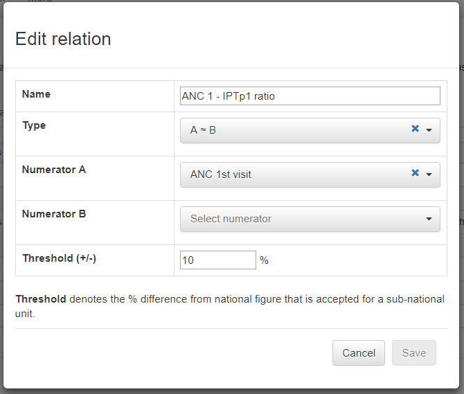

42.ANC 1 is often significantly greater than IPT 1[^5].  So we do not want to assess whether A = B.  Instead, we want to assess whether the ratio of A to B for each sub-national unit (region or district) is the same as the ratio of A to B at national level.  For this comparison, change “Type” to “Equal across orgunits”.  For relationship type of “Equal across orgunits”, the threshold is defined as the maximum % that Numerator A can differ from Numerator B.  

For example, if ANC 1 and IPTp 1 differed by more than 10%, then this might suggest a possible data quality problem.

43.You cannot Save this relation until you have specified Numerator A and Numerator B.  Numerator A is filled in by default because you have already mapped ANC 1.

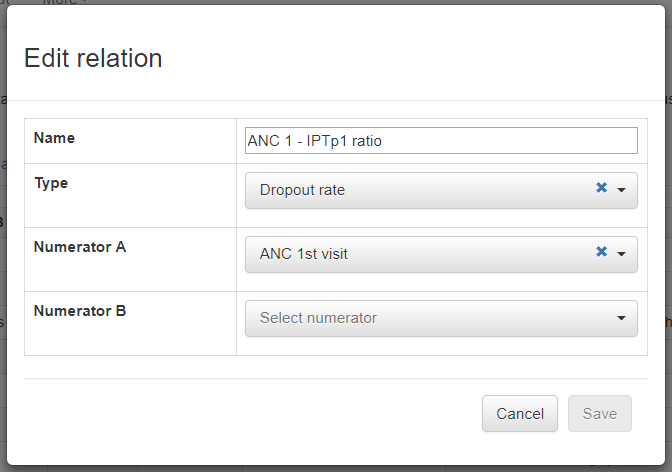

44.If you click on the down arrow to right of Numerator B, however, you will not find the numerator that you want.  This is because the drop down list includes only numerators that you have already mapped.  So, if you want to review the data using this relation, you must first go back and map the numerator “IPTp 1”.  Click Cancel to abandon for now the attempt to configure this particular numerator relation.

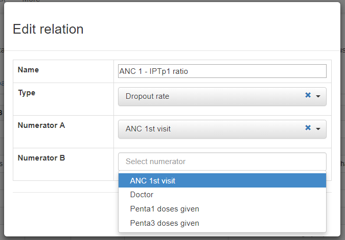

45.Next, let us click on the Add button at the bottom right of the “Numerator relations” page

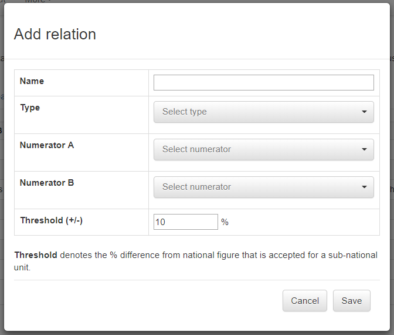

Again, all field must be filled before you will be permitted to Save the relation.  You will do this as part of the next exercise.

## Configure the “Numerator relations” page of the Tool 

46.**Exercise 3**:  From the “Numerator relations” page, configure the following relations:

    a. DPT 1 to DPT 3 dropout rate

    b. ANC 1 – DPT 1 ratio; A = B; Threshold = 10%

    c. If time permits, you should also configure one other relation of your choice.  Remember that you will not be able to Save a “Numerator relation” unless Numerator A and Numerator B have both already been mapped.

## Review the numerator quality parameters

47.While still in More-Administration, Click on the tab labeled “Numerator Quality Parameters”.  Don’t worry if, at first, you find this busy page to be a bit overwhelming.  Fortunately, the Tool comes with default quality parameters. You do not need to adjust any of these parameters until you understand how they function and have thought about how you might want to re-set them.

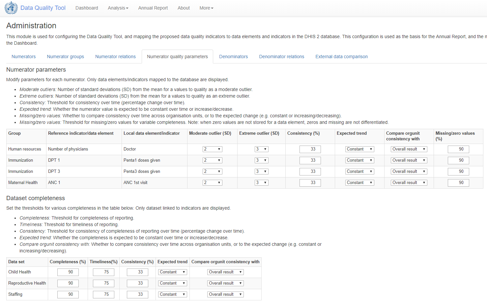

48. As one example, let us consider the parameters set for Completeness at the bottom of the page.  We can think of a threshold as being like a target.  By default, a threshold/target is set for 90% completeness.  Suppose that reporting completeness for a particular data set averages only 80% nationwide.  In this case, if you used a threshold of 90% to assess each district, you might find that almost all districts failed to meet this threshold/target.  

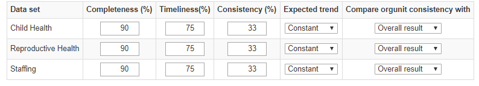

In that case, it would be appropriate to lower the completeness target to identify only those districts which had especially low completeness. You can do this by placing the cursor in the cell.  Up and down arrows will then appear which permit you to change the threshold (or you could simply type a number in the cell).  Click on the blue “Save changes” button in the lower right of the page and the Tool will then use the adjusted threshold.  The screen will not change when you click the button but the Tool will have indeed saved the change.

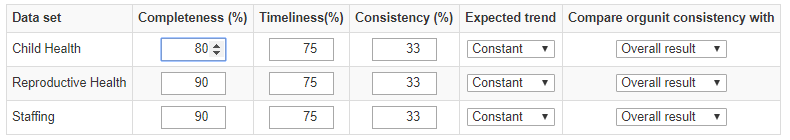

49.As another example, consider the parameters which define moderate and extreme outliers for an epidemic prone or seasonal disease such as malaria.  In most settings, we do not expect the number of reported cases of confirmed malaria to remain roughly constant from month to month.  During outbreaks or   months of increased transmission we may have values that are several standard deviations above the mean monthly value.  Hence we may want to ignore moderate outliers and set the threshold for extreme outliers to 4 standard deviations rather than 3.

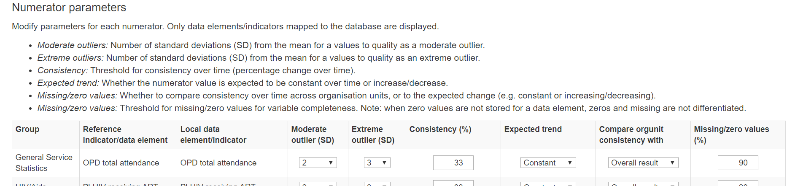

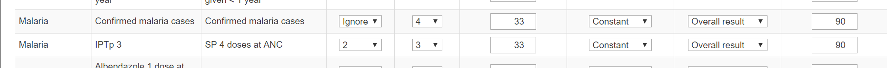

**Annex 1:  Eventual configuration of the Tool on the “play instance”**

Note:  To begin practice in configuration of the Tool, this table of numerators should at first have blank cells for “Data element/indicator” and “Dataet” for ALL reference numerators.

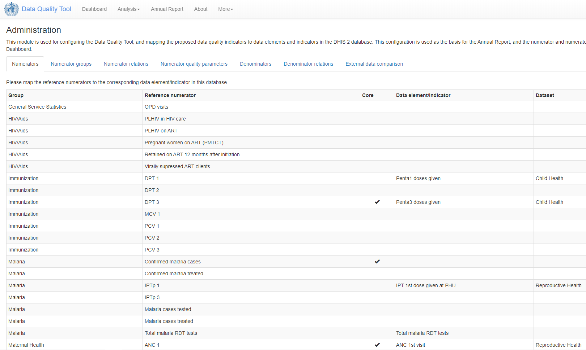

<!-- Footnotes themselves at the bottom. -->
## Notes

[^1]:

     If an earlier version of the DQ Tool is already installed, it is recommended that the latest version of the DQ Tool be installed to replace the earlier version.  Any configurations made with the earlier version will be preserved.

[^2]:

     DHIS2 assesses a data set for a given facility for a given month as “Complete” if the person entering the monthly data presses the “Complete” button.  In contrast, the Tool assesses a “Variable for completeness” as being complete if it has a non-missing value for the given facility and given month.

[^3]:

     One way to check the reliability of an indicator definition is to compare the Data Set Report (generated by the Reports-Data Set Report app) for a specific facility-month to the DHIS2 indicator value (displayed in a Pivot Table) for that facility-month.  If there appears to be a mismatch, someone with Super-User access can use the Maintenance-Indicator app to review and revise the definition of the indicator. 

[^4]:

     [http://www.who.int/healthinfo/tools_data_analysis/dqr_modules/en/](http://www.who.int/healthinfo/tools_data_analysis/dqr_modules/en/) 

[^5]:

     In practice, ANC 1 is frequently significantly greater than IPTp 1 due to missed opportunities for administering IPTp 1.  Also, women who first visit antenatal clinic during their 1st 16 weeks of pregnancy are not eligible for IPTp with SP.
