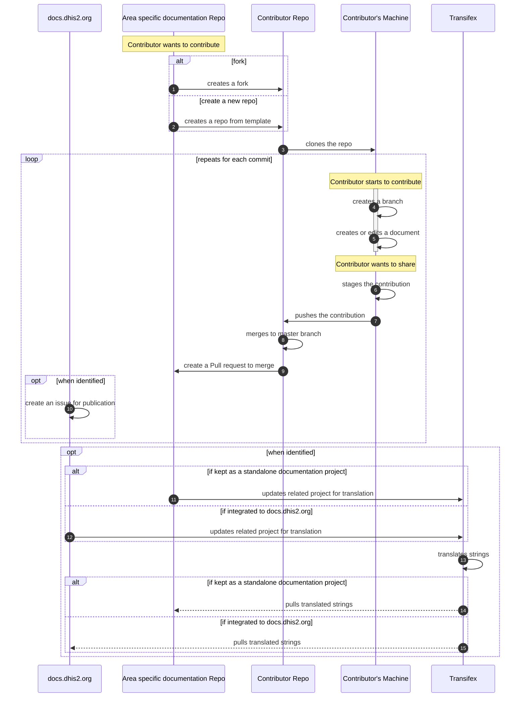

# Suggested workflow to contribute to area specific documentation

The following sequence diagram, drawn using mermaid.js illustrates in a simplified way how collaborators should contribute to a specific area documentation such as DHIS2 COVID19 Documentation or DHIS2 Android App.

We haven't found a way to display mermaid.js diagrams in Github yet, therefore we are using the [mermaid.js Live Editor](https://mermaid-js.github.io/mermaid-live-editor/) to generate an image a putting it in the documentation.

Feel free to copy the code below and paste it in the [mermaid.js Live Editor](https://mermaid-js.github.io/mermaid-live-editor/) to try it out.

