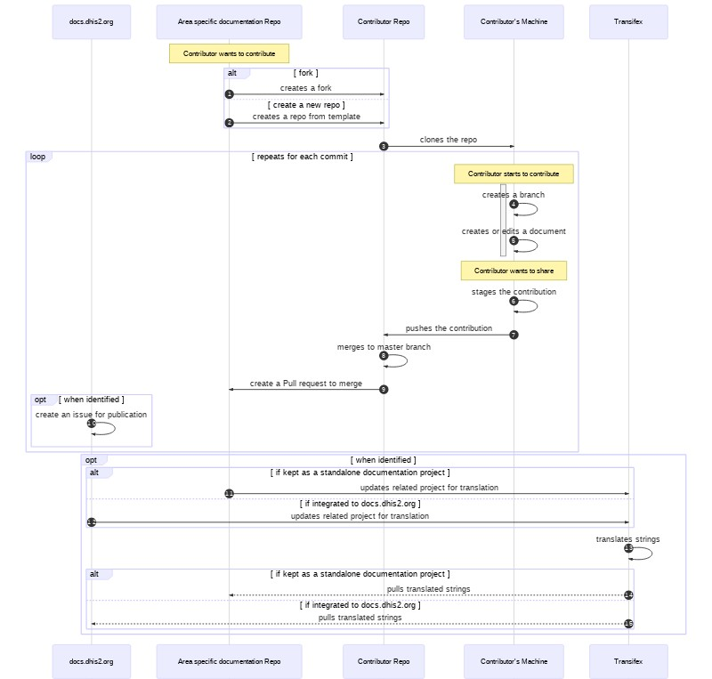

# Guidelines on how to use Markdown, Github and Transifex for our area specific DHIS2 documentation

## In a nutshell

Let's use **Markdown** as our (main) format for (most of) our documentation (except for binaries), **Github** as our sharing, collaboration and when applicable, publishing platform, and let's integrate with **Transifex** to perform translation.

Here are the key 4 steps:

1. Fork then clone the repository on Github you want to contribute to
1. Start contributing to the documentation on your local machine using Markdown
1. Push your contribution back to Github and initiate a discussion
1. Merge to make your contribution officially available and ready for translation

## Goal of these guidelines

This document aims:

* at describing a suggested workflow, step-by-step and related tools to create, edit, share, collaborate, translate and publish area specific documentation related to DHIS2;
* to be used as guidelines by contributors willing to take part in the DHIS2 documentation effort.

By **documentation**, we refer to any manual, textbook or other document supporting DHIS2 as defined by the [GNU Free Documentation License][GNU FDL]

These guidlines are not meant to be a substitute for all the great resources already available out there regarding Github or Markdown, but rather focus on the specifics of the suggested workflow and tools. Therefore, we will try as much as possible to redirect you to available resources to guide you further.

## Audience

This document is intended for contributors to the DHIS2 documentation, who are certainly tech enthusiasts ;) but are not necessarily developers.

## Context and decision factors

Google Docs is a great way to quickly create and collaborate on docs, but styling is not easy to unify, versioning is a bit tricky, publication to a large audience can be risky and it is not integrated with our translation tool.

On the other side, we can see with [docs.dhis2.org][DHIS2 docs] that the combination of **Markdown**, **Github** and **Transifex** allows for all of the above in a structured and secured manner. The 2 main drawbacks that we can see at this stage are that realtime collaboration is not as straight-forward as in Google Drive and we need to get ourselves familiar with Markdown and Github. The good news is:

* there should soon be a solution for realtime collaboration with [Codespaces][Codespaces], currently in limited beta.
* learning Markdown is reasonably fast. A 10-minute tutorial is all you need to start writing. Practicing & peer support will do the rest.  
* many tutorials (listed below) are available to grasp the basics of Github. We suggest that you go through the [First Day on GitHub][day1].
* Github made teams collaboration more accessible with [private repositories with collaborators free of charge][private repo]. This is useful for our workflow as we may not always want WIP support material, and even sometimes finalised one to be publicly available. As you may have noticed, these guidelines are currently stored in such a repo.

## Objectives

So, we want to implement of a solution that strengthen our documentation process. The workflow to be detailed in the coming sections aims at:

* reducing the workload related to maintaining area specific documentation;
* securing the distribution of the documention according to the targeted audience and channels;
* integrating area specific documentation into the standard documentation workflow whenever possible by using possible the same language (therefore the ssame tools);
* easing the standardisation of the presentation of the content by using a light and structured language;
* easing the translation of the training material by creating files in a format that can be integrated in the current workflow;
* being easy to use, after a short adaptation phase.

## Workflow and step-by-step guidelines

### Suggested workflow to contribute to area specific documentation

The following sequence diagram [^1] illustrates in a simplified way how collaborators should contribute to a specific area documentation such as DHIS2 COVID19 Documentation or DHIS2 Android App.

### Detailed workflow

Below you will find a step-by-step. May you be unfamiliar with Github, we recommnand that take a couple of hours to take the set of free courses "[First Day on GitHub][day1]"

#### Step 0 - Create an account on Github and set up Git

1. Create an account on [Github.com][github home]
1. Install the [Github Deskop client][client] on your machine. Alternatively, and if you feel confident enough, you can use command line and refer to [Github help][install git] for guidance.

!!! Warning "Important"
    May you not be with confortable with command line, we highly recommand that you use the [Github Deskop client][client] to handle the Github workflow.

#### Step 1, 2 & 3 - Set up a working copy on your computer

1. Fork the repo available on [DHIS2's Github account][dhis2 on github] you want to contribute to. This will allow you to quietly work with your own version of the project, without being impacted by the other collaborators' work. In the event that you need to create a new repository that will be added to the documentation workflow, we suggest that you use our [template repository][template repo].
1. Clone the forked/created from template repository to have it on your local machine and be able to perform any contribution you want to, such as creating a new markdown document or editing a current one.

!!! Tip "Tools to use"
    A Git client such as *Github Desktop*.

!!! Note
    You can read more on how to [clone and fork repositories using GitHub Desktop][clone fork desktop].
    May you want to have more detailed info, or if you deceided you use command line, you can read more on:

    * [forking a repository][fork] and [Creating a repository from a template][template];
    * [cloning a repository][clone].

!!! Note
    The template repository follows the structure described in the [dhis2-docs repo][dhis2-docs repo], therefore eases the integration with teh DHIS2 Documentation.

#### Step 4 & 5 - Create a branch and start writing

1. A best practice consists in creating a branch for any contribution you are about to work on. You want to do this via the Github Desktop client you have installed in [**Step 0**][step0].
1. Create and/or edit your document using Markdown as language.
1. Save your edits in your local repository.

!!! Tip "Tools to use"
    A Git client such as *Github Desktop* to create a banch and a text editor such as *Typora* to work o the document and save it.

!!! Note
    You can read more on how to [create a branch using Github Desktop][branch desktop].

#### Step 6 - Stage the changes

A best practice consists in preparing and checking and probably more importantly choosing the changes you want to commit, especially of you have done a lot of them in various files.

!!! Tip "Tools to use"
    A Git client such as *Github Desktop*.

!!! Note
    You can read more on how to [Select changes to include in a commit using Github Desktop][select change].

#### Step 7 - Push to your Github repository

Once you have chosen all the changes you want to commit, it is time to push them and make them available on the Github repository you have created in [Step 1][step1]. Remember to write a commit message to help other contributors and possible reviewers to understand what you have changed.

!!! Tip "Tools to use"
    A Git client such as *Github Desktop*.

!!! Note
    You can read more on how to [write a commit message and push your changes using Github Desktop][commit push desktop].

#### Step 8 & 9 - Pull request & update of the fork and the area specific documentation repositories

The changes you have made are now available in your fork. You want to integrate those with the rest of the documentation that is already available in the repository. To do so, you need to send a pull request and merge. In your fork this process should be fairly straightforward as you are the only one to work on it!

When the master branch of your repo includes all the changes you wanted to have, meaning when you have approved the pull request mentioned above, and in order to share and publish these changes with your target audience, you need to create a pull request to the area specific documentation repository.

!!! Tip "Tools to use"
    Tools: a Git client such as *Github Desktop* and [*DHIS2's Github account*][dhis2 on github].

!!! Note
    You can read more on how to [create a pull request using Github Desktop][pr from desktop] and/or [create a pull request from a fork][pr from fork].

#### Step 10 - update the doc portal (when identified)

When the documentation is merged and if it has been identified that it should be published on the DHIS2 Documentation portal you simply need to create an issue in the DHIS2 Documentation repository and assign it to Phil or Matthieu letting us know that resources should be added.

!!! Tip "Tools to use"
    Tools: The [DHIS2 Documentation Repository][dhis2-docs repo].

!!! Note
    You can read more on how to [create an issue in a Github repository][create issue].

Alternatively, and when suitable, the documentation can be published directly in the area specific documentation repository. More guidance will be provided.

#### Step 11, 12, 1, 14 & 15 Translate the documentation (when identified)

!!! Note
    This section will be better described.

The documentation produced for specific areas related to DHIS2 such as DHIS2 packages, DHIS2 Academy or DHIS2 Education needs, due to the international footprint of DHIS2, to be translated. The platform to support the translation effort that is integrated with the DHIS2 Documentation and DHIS2 interface is [**Transifex**][transifex hisp].

* Any area specific documentation that is integrated in the DHIS2 Documentation portal is by default pushed as a source file to be translated in Transifex to be translated. Every night the target languages are pulled from Transifex to be built and published in the DHIS2. Please create an issue in the DHIS2 Documentation repository and assign it to Phil (@Philip-Larsen-Donnelly) or Matthieu (@mrwine) letting us know that resources should be added.

* Documents to be translated and that will remain in the area specific documentation repository without being integrated in the DHIS2 Documentation can still be pushed in Transifex to be translated and translation can be pulled back to the repo. Please create an issue in the DHIS2 Documentation repository and assign it to Phil (@Philip-Larsen-Donnelly) or Matthieu (@mrwine) letting us know that resources should be added.

## Writing documentation in Markdown

This is a focus on the step 5 in our workflow

As mentioned earlier in these guidelines any *written* documentation to be produced and shared with the community or a broader audience should be written in **Markdown**. In short and as written by John Gruber, who co-developed this language, "Markdown allows you to write using an easy-to-read, easy-to-write plain text format"[^2]. Its design makes it very easy to write, read and convert. It is this simplicity, versatility and the fact that is is widely used to generate static content that pushed us to adopt Markdown.

As mentioned in the DHIS2 Documentation repository [README](https://github.com/dhis2/dhis2-docs/blob/master/README.md) we are following the [commonmark](https://commonmark.org/help/) markdown language.

!!! Warning "Important"
    If you are not yet familiar with Markdown, have a look at this ***[cheatsheet][md cheatsheet]*** and spend 10 minutes going through this ***[tutorial][tutorial]*** .

!!! Tip
    Try to write as many documents as you can using markdown to fasten the learning process and ease the chane. For example, you can write your meeting notes in markdown

### Create a new document

1. Open your preferred text editor such as VS Code or Typora
1. Create a new file and save it in your local repository.

### Edit a document already available in repo

This is probably the most straight forward:

1. Open the document in your preferred text editor such as VS Code or Typora
1. Edit and save

!!! Tip
    Remember that you collaborate. This means that other contributors perform changes as well. A best practice is to pull the latest version locally of the repo before starting to edit a document.

### Convert a document that we have already created

A lot of documentation has of course already been created and the purpose of setting up this workflow is to work faster and better. So if some disruption is acceptable as part of the adoption process, we should not lose too much time and spend too many efforts to adapt the content item that are now available and close to be ready to be integrated from Google Drive to Open edX. At the same time, we want to keep in mind that the Markdown files need to be our source files, meaning the files containing the latest available vsersion of the content item. Therefore, we highly recommend to use the add-on **[Docs to Markdown][add-on]**

1. Install the add-on following the procedure described in the GSuite Marketplace.
1. Open the Google doc you want to convert to Markdown
1. In the menu bar, click on *'Add-ons'>'Docs to Markdown'> Convert*
1. In the Docs to Markdown pane onth right hand side, click the button *'Markdown'*
1. Select the relevant content, basically everything between the `<!----- Conversion time ... ----->`and `<!-- Docs to Markdown version ... -->`
1. Copy the selected content and paste it in a newly created source file in your local repo and save it with the`.md`extension.
1. Check the result of the conversion:
   * pay attention to the warnings generated during the conversion
   * add the images in the local repository and update the links to match the folder structure
   * update the anchors of the headings by replacing the id with the actual heading preceded with a `#` and in `()` The heading needs to be transformed a bit and include the words only, in lowercase and with a `-`between each word. For example [my anchor](#my-heading-can-be-long-and-even-more).
   * replace any remaning `html` tags with `markdown` language. This specifically applies to tables and images.
1. Save your edits

!!! Tip "Extracting images"
    To fasten the extraction of images from Google Doc, we suggest that you download the document as a `Web page (.html, zipped)`. You will find all you images (unamed and uncropped) in one folder.

!!! Tip "Converting tables"
    To fasten the conversion, you can use online tools such as [TableConvert][tableconvert] where you can copy/paste the html table and convert into Markdown. Please note that markdown only allows for [simple tables][gmf table]. If you have complex tables with a lot of styling such as merged cells, lists and paragraphs, you will need to think through and adopt another way to present the information.

### Suggested Tools

Tools play a key part in the success in the implementation of these guidelines. Plenty of Markdown editors and convertors are available out there. Provided both our current collaborative environment(s9), Google Drive & Github, and 'philosophy' that we want to follow (open-source, cross-platform,efficient & user friendly tools), we would suggest:

#### Offline editors

This should be your preferred to either create or edit. Any text editor, can do the job. We strongly recommend that you use one that one which can help with 1) the light styling of Markdown 2) the rendering.

* [Typora][typora] (open source & free), available on Linux, MacOSX and Windows is a nice app, that eases the creation of table and integrates mermaid.js to create diagrams.
* [Visual Studio Code][vs code], with the extension [Markdown Preview Enhanced][vsc mpe] is another cross-platform tool This one is a bit more tech savvy.

#### Online editors

You may want, especially if you are collaborating using Google Drive, use an online editor. In that regard, the open source [StackEdit][StackEdit] which is integrated with Google Drive as a 3rd party app can be a good option. It has a WYSIWYG interface, which is pretty handy when beginning with Markdown and allows you to open or create Markdown files directly from Google Drive, once added as an app.

#### Other Markdown Editors

Below is a list of other Markdown editors worth being looked at

* **Offline**
  * [Atom][atom] with the extension [Markdown Preview Enhanced][atom mpe], works on Linux, Mac and Windows

* **Online editor**
  * [Dillinger][Dillinger], free and somehow integrated with Google Drive
  * [HAckMD][HAckMD]

### Standalone version of the documentation

In some contexts sharing standalone versions of the documentation is mandatory. The worflow needs to be described. We can already mention though that we recommand to Pandod to generate PDF, docx, pptx versions of the documentation. Feel free to reach us for support.

#### A next step - slides, towards a more automatised workflow

I am testing tools to use Markdown to create slides and this looks promising. If it is successful this would be a tremendous way forward in terms of integration especially to the translation workflow. More to come...

## Extra resources

### GIT and Github

* [GIT Documentation][git doc]
* [Github Documentation][github help]

### Markdown

* [Commonmark Cheatsheet][commonmark help]

[^1]: using [mermaid.js][sequence diagram], which is integrated in Typora as well as in Atom and Visual Studio Code with the mardown extension [Markdown Preview Enhanced][mpe]
[^2]: [source: https://daringfireball.net/projects/markdown/](https://daringfireball.net/projects/markdown/)

[why markdown]: https://medium.com/@stymied/why-you-should-and-should-not-use-markdown-1b9d70987792%20carly%20comando
[slides]: https://medium.com/@stymied/what-slides-from-markdown-5239ed31e7ac
[getting started with markdown]: https://www.markdownguide.org/getting-started/
[transifex]: https://www.transifex.com/hisp-uio/
[pandoc]: https://pandoc.org/index.html
[StackEdit]: https://stackedit.io/app
[Dillinger]: https://dillinger.io/
[HackMD]: https://hackmd.io/
[Typora]: https://typora.io/
[Atom]: https://atom.io/
[add-on]: https://gsuite.google.com/marketplace/app/docs_to_markdown/700168918607
[md cheatsheet]: https://commonmark.org/help/
[tutorial]: https://commonmark.org/help/tutorial/
[atom mpe]: https://atom.io/packages/markdown-preview-enhanced
[vsc mpe]: https://marketplace.visualstudio.com/items?itemName=shd101wyy.markdown-preview-enhanced
[GNU FDL]: https://www.gnu.org/licenses/fdl-1.3.html
[Codespaces]: https://github.com/features/codespaces/
[DHIS2 DOCS]: https://docs.dhis2.org/
[client]: https://desktop.github.com/
[repo]: https://tobedefined.org
[day1]: https://lab.github.com/githubtraining/paths/first-day-on-github
[install git]: https://help.github.com/en/github/getting-started-with-github/set-up-git
[github home]: https://github.com/
[dhis2 on github]: https://github.com/dhis2
[private repo]: (https://github.blog/2020-04-14-github-is-now-free-for-teams/)
[sequence diagram]: https://mermaid-js.github.io/mermaid/#/sequenceDiagram
[mpe]: https://shd101wyy.github.io/markdown-preview-enhanced/#/
[git doc]: https://git-scm.com/doc
[github help]: https://help.github.com/en/github
[commonmark help]: https://commonmark.org/help/
[template]:https://help.github.com/en/github/creating-cloning-and-archiving-repositories/creating-a-repository-from-a-template
[fork]: https://help.github.com/en/github/getting-started-with-github/fork-a-repo
[clone fork desktop]: https://help.github.com/en/desktop/contributing-to-projects/cloning-and-forking-repositories-from-github-desktop
[clone]: https://help.github.com/en/github/creating-cloning-and-archiving-repositories/cloning-a-repository-from-github
[step0]: #step-0-create-an-account-on-github-and-set-up-git
[branch desktop]: https://help.github.com/en/desktop/contributing-to-projects/making-changes-in-a-branch
[dhis2-docs repo]: https://github.com/dhis2/dhis2-docs#structure
[select change]: https://help.github.com/en/desktop/contributing-to-projects/committing-and-reviewing-changes-to-your-project#2-selecting-changes-to-include-in-a-commit
[step1]: #step-1-2-3-set-up-a-working-copy-on-your-computer
[commit push desktop]: https://help.github.com/en/desktop/contributing-to-projects/committing-and-reviewing-changes-to-your-project#3-write-a-commit-message-and-push-your-changes
[pr from fork]: https://help.github.com/en/github/collaborating-with-issues-and-pull-requests/about-pull-requests
[pr from desktop]: https://help.github.com/en/desktop/contributing-to-projects/creating-an-issue-or-pull-request#creating-a-new-pull-request
[create issue]: https://help.github.com/en/github/managing-your-work-on-github/creating-an-issue
[transifex hisp]: https://www.transifex.com/hisp-uio/public/
[vs code]: https://code.visualstudio.com/
[atom]: https://atom.io/
[tableconvert]: https://tableconvert.com/
[gmf table]: https://help.github.com/en/github/writing-on-github/organizing-information-with-tables#creating-a-table
[template repo]: tbd
